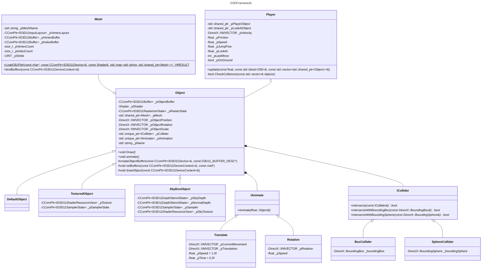

```mermaid
---
title: D3DFramework
---
classDiagram
  class Object{
  +void Draw()*
  +void animate()
  #createObjectBuffer(const CComPtr~ID3D11Device~&, const D3D11_BUFFER_DESC*)
  #void setBuffers(const CComPtr~ID3D11DeviceContext~&, const void*)
  #void drawObject(const CComPtr~ID3D11DeviceContext~&)
  -CComPtr~ID3D11Buffer~ _pObjectBuffer
  -Shader _pShader
  -CComPtr~ID3D11RasterizerState~ _pRasterState
  -std::shared_ptr~Mesh~ _pMesh
  -DirectX::XMVECTOR _pObjectPosition
  -DirectX::XMVECTOR _pObjectRotation
  -DirectX::XMVECTOR _pObjectScale
  -std::unique_ptr~ICollider~ _pCollider
  -std::unique_ptr~IAnimate~ _pAnimation
  -std::string _pName
  }

  Object <|-- DefaultObject
  Object <|-- TexturedObject

  class TexturedObject{
  -CComPtr~ID3D11ShaderResourceView~ _pTexture
  -CComPtr~ID3D11SamplerState~ _pSamplerState
  }

  Object <|-- SkyBoxObject

  class SkyBoxObject{
  -CComPtr~ID3D11DepthStencilState~ _pSkyDepth
  -CComPtr~ID3D11DepthStencilState~ _pNormalDepth
  -CComPtr~ID3D11SamplerState~ _pSampler
  -CComPtr~ID3D11ShaderResourceView~ _pSkyTexture
  }

  Mesh --o Object

  class Mesh{
  +LoadOBJFile(const char*, const CComPtr~ID3D11Device~&, const Shader&, std::map~std::string, std::shared_ptr~Mesh~~) HRESULT$
  +bindBuffers(const CComPtr~ID3D11DeviceContext~&)
  -std::string _pMeshName
  -CComPtr~ID3D11InputLayout~ _pVertexLayout
  -CComPtr~ID3D11Buffer~ _pVertexBuffer
  -CComPtr~ID3D11Buffer~ _pIndexBuffer
  -size_t _pVertexCount
  -size_t _pIndexCount
  -UINT _pStride
  }

  Object *-- IAnimate

  class IAnimate{
  +Animate(float, Object&)*
  }

  IAnimate <|-- Translate

  class Translate{
  -DirectX::XMVECTOR _pCurrentMovement
  -DirectX::XMVECTOR _pTranslation
  -float _pSpeed = 1.0f
  -float _pTime = 0.0f
  }

  IAnimate <|-- Rotation

  class Rotation{
  -DirectX::XMVECTOR _pRotation
  -float _pSpeed
  }

  Player o-- Object

  class Player{
  +update(const float, const std::bitset~256~&, const std::vector~std::shared_ptr~Object~~&)
  -std::shared_ptr<Object> _pPlayerObject
  -std::shared_ptr<Object> _pLookAtObject
  -DirectX::XMVECTOR _pVelocity
  -float _pFriction
  -float _pSpeed
  -float _pJumpPow
  -float _pLookAt
  -int _pLastMove
  -bool _pOnGround
  -bool CheckCollisions(const std::vector<std::shared_ptr<Object>>& objects)
  }

  Object *-- ICollider

  class ICollider{
  +intersects(const ICollider&) bool*
  +intersectsWithBoundingBox(const DirectX::BoundingBox&) bool*
  +intersectsWithBoundingSphere(const DirectX::BoundingSphere&) bool*
  }

  ICollider <|-- BoxCollider

  class BoxCollider{
  -DirectX::BoundingBox _boundingBox
  }

  ICollider <|-- SphereCollider

  class SphereCollider{
  -DirectX::BoundingSphere _boundingSphere
  }
```
